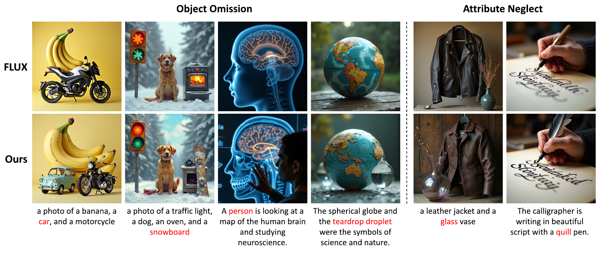

# Diagnosing and Correcting Concept Omission in Multimodal Diffusion Transformers

> Official code for the paper **"Diagnosing and Correcting Concept Omission in Multimodal Diffusion Transformers"**
> ICML 2026 | [arXiv](https://arxiv.org/abs/2605.14270)


## Introduction



Multimodal Diffusion Transformers (MM-DiTs) have achieved remarkable progress in text-to-image generation, yet they frequently suffer from concept omission, where specified objects or attributes fail to emerge in the generated image. By performing linear probing on text tokens, we demonstrate that text embeddings can distinguish a characteristic `omission signal' representing the absence of target concepts. Leveraging this insight, we propose Omission Signal Intervention (OSI), which amplifies the omission signal to actively catalyze the generation of missing concepts. Comprehensive experiments on FLUX.1-Dev and SD3.5-Medium demonstrate that OSI significantly alleviates concept omission even in extreme scenarios.

## Setup

```bash
conda create -n osi python=3.10 -y
conda activate osi

# Install PyTorch (adjust CUDA version as needed)
pip install torch torchvision --index-url https://download.pytorch.org/whl/cu121

pip install -r requirements.txt
python -m spacy download en_core_web_sm
```

## Pretrained Classifiers

Pre-trained classifiers are included in `classifier_ckpt/`:

| Model | Path |
|-------|------|
| FLUX.1-dev | `classifier_ckpt/flux/` |
| SD3.5-Medium | `classifier_ckpt/sd3/` |

## Quick Start

### FLUX.1-dev

```bash
CUDA_VISIBLE_DEVICES=0 python generate_demo.py \
  --prompt "a dog and a cat" \
  --target_tokens dog cat \
```

| Argument | Default | Description |
|----------|---------|-------------|
| `--prompt` | (required) | Text prompt |
| `--target_tokens` | (required) | Space-separated target concepts |
| `--alpha` | `5.0` | Steering strength |
| `--num_head` | `300` | Number of attention heads to steer |
| `--intervention_end` | `15` | Stop steering at this denoising step (out of 30) |
| `--classifier_dir` | `classifier_ckpt/flux` | Path to classifier directory |
| `--seed` | `42` | Random seed |
| `--output` | `{prompt}_{seed}.png` | Output image path |

### SD3.5-Medium

```bash
CUDA_VISIBLE_DEVICES=0 python generate_demo_sd3.py \
  --prompt "a dog and a cat" \
  --target_tokens dog cat \
```

| Argument | Default | Description |
|----------|---------|-------------|
| `--prompt` | (required) | Text prompt |
| `--target_tokens` | (required) | Space-separated target concepts |
| `--alpha` | `7.5` | Steering strength |
| `--num_head` | `100` | Number of attention heads to steer |
| `--intervention_end` | `15` | Stop steering at this denoising step (out of 30) |
| `--classifier_dir` | `classifier_ckpt/sd3` | Path to classifier directory |
| `--seed` | `42` | Random seed |
| `--output` | `{prompt}_{seed}.png` | Output image path |

## Data Collection Demo

`collect_data_demo.py` shows how we collect key vectors for classifier training. For a single prompt, it saves both the generated image and the attention key hidden states:

```bash
CUDA_VISIBLE_DEVICES=0 python collect_data_demo.py \
  --prompt "a dog and a cat" \
  --target_tokens dog cat \
  --output_dir ./collected
# → collected/a dog and a cat_42.png
# → collected/a dog and a cat_42.pkl  (key vectors per timestep/layer/head)
```

## Roadmap

- [x] Inference demo (FLUX.1-dev, SD3.5-Medium)
- [x] Pre-trained classifiers
- [x] Data collection demo
- [ ] Data labeling pipeline
- [ ] Classifier training code
- [ ] Full benchmark generation & evaluation scripts


## Repository Structure

```
OSI/
├── classifier_ckpt/
│   ├── flux/                  # Pre-trained FLUX.1-dev classifier
│   └── sd3/                   # Pre-trained SD3.5-Medium classifier
├── flux_osi_modules/
│   ├── pipeline.py            # FluxPipeline_custom
│   └── models.py              # FluxAttnProcessor_custom
├── sd3_osi_modules/
│   ├── pipeline.py            # StableDiffusion3Pipeline_custom
│   └── models.py              # SD3AttnProcessor_custom
├── generate_demo.py           # FLUX.1-dev single-image demo
├── generate_demo_sd3.py       # SD3.5-Medium single-image demo
├── collect_data_demo.py       # Data collection demo (key vector saving)
├── figure/
│   └── thumbnail.png
├── requirements.txt
└── README.md
```


## Citation

```bibtex
@article{baek2026diagnosing,
  title={Diagnosing and Correcting Concept Omission in Multimodal Diffusion Transformers},
  author={Baek, Kanghyun and Lew, Jaihyun and Shin, Chaehun and Lee, Jungbeom and Yoon, Sungroh},
  journal={arXiv preprint arXiv:2605.14270},
  year={2026}
}
```
